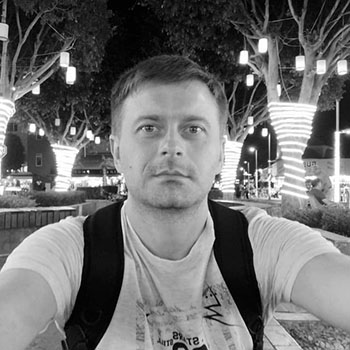

# Yury Labatsevich



## Contacts

* __Location__: Minsk,Belarus
* __Email__:    yuralabatsevich@gmail.com
* __Phone__:    +375 29 5925384
* __Telegram__: [@Yuri_Labatsevich](https://t.me/Yuri_Labatsevich)
* __GitHub__:   [labatsevich](https://github.com/labatsevich)
* __Discord__:Yura Labatsevich#5669

## About me

I am 35 years old. My goal -  to change the development stack, has always been an interesting area of front-end development. At the moment I work on the position 1C programmer in the transport company.
There is experience in developing solutions for system integration, http services within 1C environment.
In my spare time I try to learn new technologies and tools, I love programming and coffee.
Sociable, always trying to find common ground with colleagues, making efforts to achieve the goal in solving the task.

## Skills

* 1C
* HTML
* CSS (Frameworks Bootstrap, Bulma)
* JavaScript (Fundamentals, DOM, Asynchronous JavaScript, function programming),JSON
* PHP 5-7: Laravel(Basic knowledge), CakePHP(Basic knowledge), Wordpress(Basic knowledge)
* Mysql,T-SQL(Basic knowledge)
* C#(Basic knowledge), Java(Basic knowledge)
* Git/GitHub(Basic knowledge)
* Windows OS, Linux(Ubuntu)
* System Administration (Active Directory, DNS, DHCP)

## Code examples

```javascript

const multiply = function (a, b) {
  return a * b;
};

console.log(multiply(2,3));
```

## Education

* __Belarusian-Russian University__
  * Faculty of Electrical Engineering

## Experience

Have experience in web development. Until recently, I’ve been involved in supporting and refining the [electronic catalog](https://viko-t.by) of the company engaged in the sale of electronics.
I also made small websites and landing pages.
For example:

* [sto-delphi.by](https://sto-delphi.by/)

* [alif-dmc.ae](https://alif-dmc.ae)

## Languages

* Russian - native speaker
* English
  * Tutoring
  * [EPAM English test result A1](https://examinator.epam.com/Main/PersonalAssignments/318476). But i'm sure that my level higher, i think A2. I’m constantly trying to improve my English
